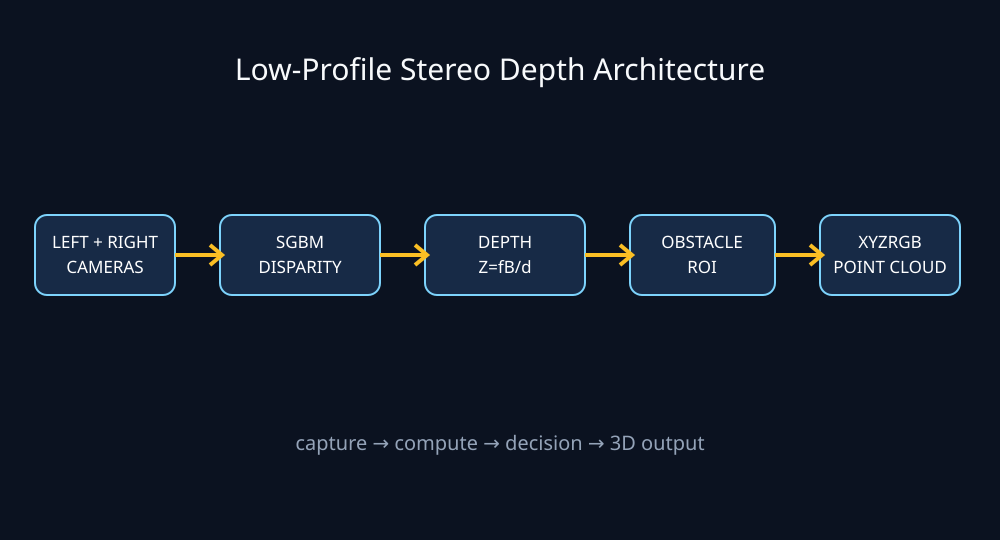
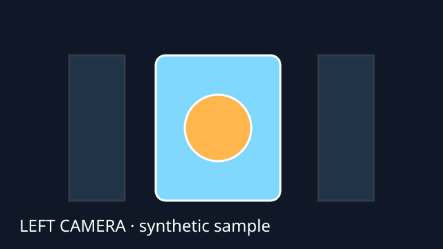
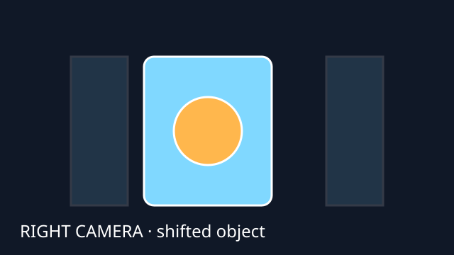
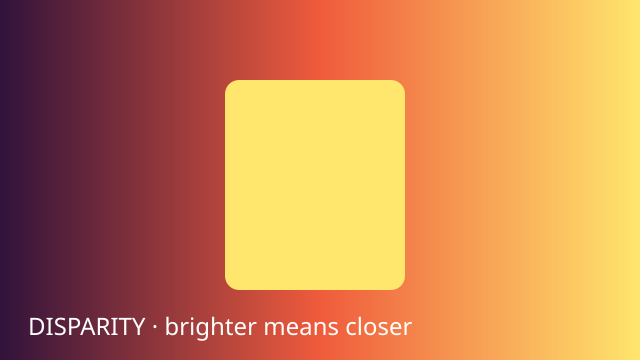

# Stereo Depth Mini Project

A recruiter-ready, low-profile stereo-vision prototype inspired by the original [Low-Cost Hardware-Accelerated Vision-Based Depth Perception](https://github.com/AdityaNG/Low-Cost-Hardware-Accelerated-Vision-Based-Depth-Perception-for-Real-Time-Applications) project.

This repository turns the research idea into a reproducible end-to-end mini product: two horizontally aligned cameras produce a disparity image, disparity is converted into metric depth, nearby regions are highlighted as obstacles, and a colored point cloud can be exported for 3D inspection.



## Why this project is practical

- **Low profile:** two small USB/CSI cameras with a 60–100 mm baseline can fit behind a thin enclosure.
- **Low cost:** works on a laptop, Raspberry Pi-class computer, or Jetson without requiring a custom CUDA build.
- **Deployable pipeline:** capture → rectify/prepare → stereo matching → depth → obstacle warning → visualization.
- **Reproducible demo:** synthetic stereo images are included, so the complete pipeline runs without hardware.
- **Transferable engineering:** configuration, validation, unit tests, CLI entry points, and documented limitations are included.

## Demo outputs

The repository includes lightweight, editable SVG sample images so GitHub renders the idea immediately without committing large binary assets.

| Input / output | Preview |
|---|---|
| Left camera sample |  |
| Right camera sample |  |
| Disparity concept |  |
| Architecture |  |

Running the demo writes PNG outputs to `outputs/` and a CSV point cloud to `outputs/point_cloud.csv`.

## Architecture

1. **Stereo capture** — reads a synchronized left/right pair from files or two cameras.
2. **Calibration boundary** — accepts rectified images; real deployments should use the included calibration template and OpenCV stereo calibration.
3. **Stereo matcher** — OpenCV StereoSGBM estimates horizontal pixel displacement (disparity).
4. **Metric depth** — computes `Z = focal_length × baseline / disparity`.
5. **Safety layer** — measures the closest valid region in a configurable center ROI and reports an obstacle warning.
6. **3D output** — reprojects valid pixels to XYZ and exports a compact colored point cloud.
7. **Presentation** — saves a colorized disparity map, depth map, obstacle mask, and JSON summary.

See the detailed [architecture diagram](docs/architecture.svg).

## Quick start

```bash
python -m venv .venv
source .venv/bin/activate                 # Windows: .venv\\Scripts\\activate
python -m pip install -r requirements.txt
python examples/synthetic_demo.py        # creates data/*.png
python -m stereo_depth --left data/sample_left.png --right data/sample_right.png
python -m stereo_depth.obstacle_detector --depth outputs/depth_m.png
```

The CLI creates:

- `outputs/disparity.png` — normalized disparity visualization
- `outputs/depth_m.png` — 16-bit depth image in millimeters
- `outputs/obstacle_mask.png` — configurable obstacle mask
- `outputs/point_cloud.csv` — XYZRGB points
- `outputs/summary.json` — run metadata and nearest-object estimate

Use a real pair:

```bash
python -m stereo_depth \
  --left path/to/left.png \
  --right path/to/right.png \
  --baseline 0.075 \
  --focal-length 520 \
  --output outputs/real_run
```

For two cameras:

```bash
python examples/live_demo.py --left-camera 0 --right-camera 1
```

Press `q` to quit. The cameras must be synchronized and mechanically aligned for useful results.

## Calibration

The included `config/calibration.example.yml` documents the required baseline and focal length. For accurate metric depth:

1. Print a checkerboard.
2. Capture it at multiple positions with both cameras.
3. Run stereo calibration with OpenCV.
4. Rectify both frames before calling the matcher.
5. Replace the example values with the calibrated focal length and baseline.

The synthetic demo uses a known focal length and baseline to make the math inspectable. It is not a substitute for physical calibration.

## Hardware bill of materials

| Part | Suggested choice | Purpose |
|---|---|---|
| 2 cameras | OV9281/IMX219 USB or CSI modules | synchronized stereo images |
| Mount | 3D-printed 60–100 mm bracket | fixed baseline and alignment |
| Computer | laptop, Raspberry Pi 4, or Jetson Nano | inference and visualization |
| Optional IR | 850 nm LED pair | improves low-texture indoor scenes |

## Engineering notes and limitations

- Stereo depth is less reliable on textureless, reflective, or occluded surfaces.
- The two cameras must expose frames at the same time; sequential webcams create motion artifacts.
- `StereoSGBM` is the portable CPU baseline. A CUDA SGM backend can replace it behind the same `compute_disparity()` interface.
- Depth is only metric after calibration. The sample values are illustrative.
- This prototype is for experimentation, not safety-critical collision avoidance.

## Tests

```bash
python -m pytest
```

## Project layout

```text
.
├── config/calibration.example.yml
├── data/                         # small SVG previews; PNGs are generated locally
├── docs/architecture.svg
├── examples/synthetic_demo.py
├── examples/live_demo.py
├── src/stereo_depth/             # reusable package and CLI
├── tests/test_depth.py
├── requirements.txt
└── pyproject.toml
```

## Attribution

The concept is inspired by the original research repository and its authors. This mini-project is an independent educational implementation with a simplified OpenCV/Python pipeline.

## License

GPL-3.0, matching the original project family.
